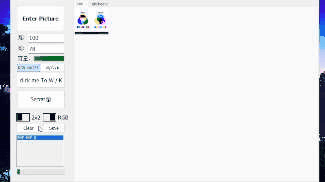
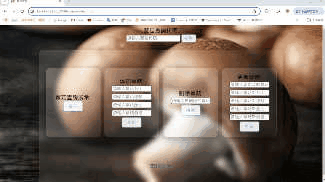
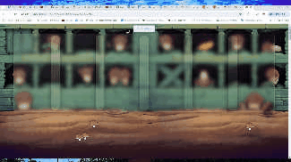

# 在學期間的小程式

大部分在學期間使用 C/C++ 進行開發的各種小程式，只要開啟各檔中的.exe檔即可直接運作。
網頁設計的HTML檔可直接開啟，但蘑菇查詢系統基於tomcat才能使用。

## 目錄

- [目錄](#目錄)
- [使用方法](#使用方法)
- [BMP圖檔加解密](#BMP圖檔加解密)
- [中序、後序、前序運算式轉換](#中序、後序、前序運算式轉換)
- [老鼠走迷宮](#老鼠走迷宮)
- [排列+河內塔（遞迴）](#排列+河內塔（遞迴）)
- [蘑菇查詢系統](#蘑菇查詢系統)
- [網頁設計實作](#網頁設計實作)
- [許可證](#許可證)

## 使用方法

這裡展示如何運行C++ builder C/C++ 程式：

1. 打開專案目錄：

2. 下載.exe檔：

3. 雙擊以運行程式

# BMP圖檔加解密

[Watch the video](videos/2024-05-17%2016-27-52.mkv)

# 中序、後序、前序運算式轉換

# 老鼠走迷宮

# 排列+河內塔（遞迴）

# 蘑菇查詢系統

[Watch the video](videos/2024-05-17%2013-42-15.mkv)

# 網頁設計實作

[Watch the video](videos/2024-05-17%2013-57-33.mkv)

## 許可證

MIT © 2024 js051
